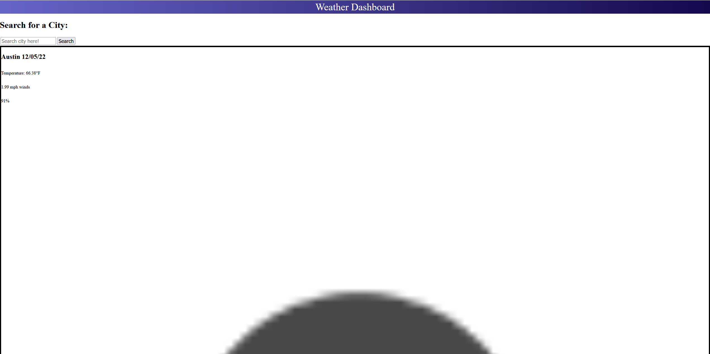

# Weather-Dashboard

# Description
The Weather Dashboard application will allow you to search for a city and see the current temperature, winds, and humidity.

# Goal
The goal is to provide a simple and effective way for you to search for the weather and forecast in the city of your choice.

# Use
Type a city in the search bar to see the weather and forecast for the next 5 days.

# Links
GitHub: https://github.com/sdfields/Weather-Dashboard
URL: https://sdfields.github.io/Weather-Dashboard/

# License
MIT License

# Screenshot
